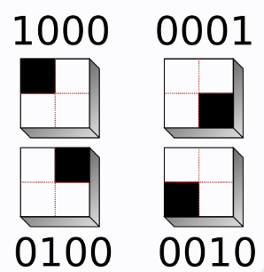

# RMA.jl


[](https://julialang.org/)



A simple and faster library for recurrence microstates analysis.

### 📦 Dependencies

The library uses the package Distances.jl, that is installed along with the library when you use Julia's Pkg.

[](https://juliahub.com/ui/Packages/Distances)


### ⚙️ Installation

1. Using `Pkg.add`:
  With the Julia terminal open, type:

```julia
using Pkg
Pkg.add(url="https://github.com/DynamicsUFPR/RMA.jl")
```

2. Using the Pkg REPL mode (press `]` in the Julia terminal):

```julia
add https://github.com/DynamicsUFPR/RMA.jl
```


## Library usage guide

Acess the library documentation [here](https://dynamicsufpr.github.io/RMA.jl/).


## Academic Information

###  Citation
There is no published article yet.

###  References
1. [J.-P. Eckmann, S. O. Kamphorst, and D. Ruelle, Europhys. Lett 4, 973 (1987)](https://iopscience.iop.org/article/10.1209/0295-5075/4/9/004)
2. [G. Corso, T. de Lima Prado, G. Z. dos Santos Lima, J. Kurths, and S. R. Lopes, Chaos 28 (2018)](https://repositorio.ufrn.br/bitstream/123456789/30826/1/QuantifyingEntropyUsing_Lima_2018.pdf)
3. [N. Marwan, J. Kurths, and P. Saparin, Physics Letters A 360, 545 (2007)](https://www.sciencedirect.com/science/article/pii/S0375960106013089)
4. [T. L. Prado, V. S. Machado, G. Corso, G. Zampier, S. Lima, S. R. Lopes, How to compute suitable vicinity parameter and sampling time of recurrence analysis, avaliable at SSRN (2023).](https://papers.ssrn.com/sol3/papers.cfm?abstract_id=4111917)
5. [Y. Hirata, Recurrence plots for characterizing random dynamical systems, Communications in Nonlinear Science and Numerical Simulation 94 (3 2021)](https://www.sciencedirect.com/science/article/pii/S1007570420303828)
