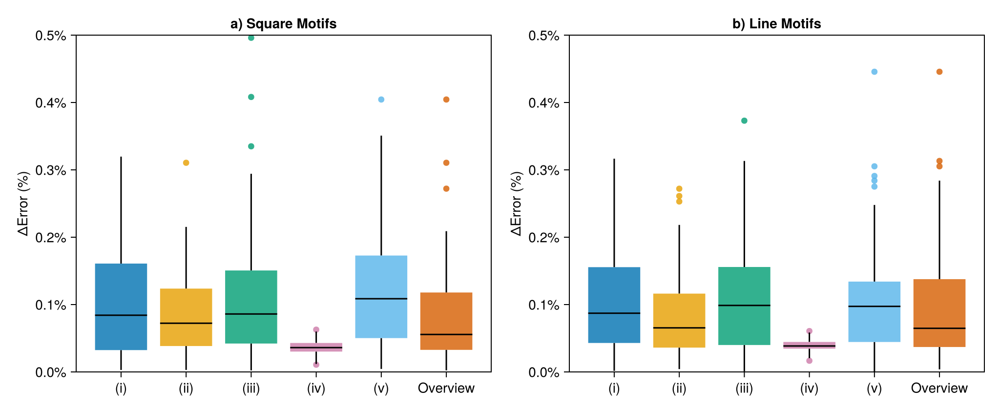

#   Recurrence Quantification Analysis
The recurrence microstate analysis allows us to estimate values of typical RQA measures, such as determinism and laminarity, with a good precision, and defines some novel quantifiers. We will demonstate in this page how compute these quantifiers using a uniform distribution as input.
```@repl rqa
using RecurrenceMicrostatesAnalysis, Distributions        # Generate our data =D
data = rand(Uniform(0, 1), 3000);
th, s = find_parameters(data, 3)
dist = distribution(data, th, 3);
```
##  Recurrence Entropy
To compute the recurrence entropy, it is possible to use the `rentropy` function that receives a recurrence motif probability distribution.
```@repl rqa
entr = rentropy(dist)
```

!!! info
    Note that the entropy computed is also returned by the `find_parameters` function.

The `rentropy` function has also a keyword argument that can be used to ignore some motifs.
```@repl rqa
entr = rentropy(dist; ignore_motifs = [1, 512])
```

!!! info
    Note that the **kword** `ignore_motifs` uses as index the notation of Julia, beginning in 1, instead 0. So, the motif 0 is identified by the number 1.

##  Recurrence Rate
The recurrence rate (RR) can be computed using a similar method to the recurrence entropy.
```@repl rqa
rr = rrate(dist)
```

Since the recurrence rate is an estimated measure, it has a small error, how you can check in the following graphic, that displays the relative error between the RR computed by `RecurrenceMicrostatesAnalysis.jl` and the standard approach.


##  Determinism
The determinism (DET) can be computed using a recurrence motifs probability distribution and the recurrence rate. It is important to note that it can be done using two motif constrained shapes: `:square` or `:diagonal`.
```@repl rqa
det = determinism(rr, dist)
det = determinism(rr, distribution(data, th, 3; shape = :diagonal))
```

Similar to RR, the determinism is a quantifier estimated using recurrence microstates analysis, so it has a small error that is demonstrated in the following figure.


!!! info
    (i) is the uniform distribution, (ii) is the Lorenz system, (iii) is the Logistic map, (iv) is the Rössler system, and (v) is the Bernoulli shifted generalized.

!!! warning
    Determinism (DET) just can be computed using `:square` or `:diagonal` shapes.

We implement an way to do it without the need to compute the recurrence distributions.
```@repl rqa
det = determinism(data, th)
```

!!! info
    When we estimate DET directly using this function overload, the library will automatically use a diagonal motif constrained shape.

##  Laminarity
The laminarity (LAM) can be computed with a method similar to determinism (DET). It is important to note that it can be done using two motif constrained shapes: `:square` or `:line`.
```@repl rqa
lam = laminarity(rr, dist)
lam = laminarity(rr, distribution(data, th, 3; shape = :line))
```

In the same way, laminarity has a small error associated to it estimation. You can check it in the next figure.


!!! info
    (i) is the uniform distribution, (ii) is the Lorenz system, (iii) is the Logistic map, (iv) is the Rössler system, and (v) is the Bernoulli shifted generalized.

!!! warning
    Laminarity (LAM) just can be computed using `:square` or `:line` shapes.

We implement an way to do it without the need to compute the recurrence distributions.
```@repl rqa
lam = laminarity(data, th)
```

!!! info
    When we estimate LAM directly using this function overload, the library will automatically use a line motif constrained shape.

##  Disorder
Disorder is a very powerful quantifier introduced by Flauzino et al.[Flauzino2025](@cite) in 2025. The computation of this quantifier is very simple using `RecurrenceMicrostatesAnalysis.jl`:

```@repl rqa
microstate_size = 3
Ξ = disorder(data, microstate_size)
```

!!! info
    Read more about disorder [here](https://doi.org/10.1103/1y98-x33s).

!!! warning
    The microstate size can only be $2$, $3$, or $4$.

!!! warning
    The function `disorder` tries to maximize the disorder for a range of $\varepsilon$. To compute it faster, we recommend defining a base value of $\varepsilon$ and a range around it. For example:
    ```@repl rqa
    Ξ = disorder(data, microstate_size; ε_min = 0.9 * th, ε_max = 1.1 * th, ε_range_size = 6)
    ```