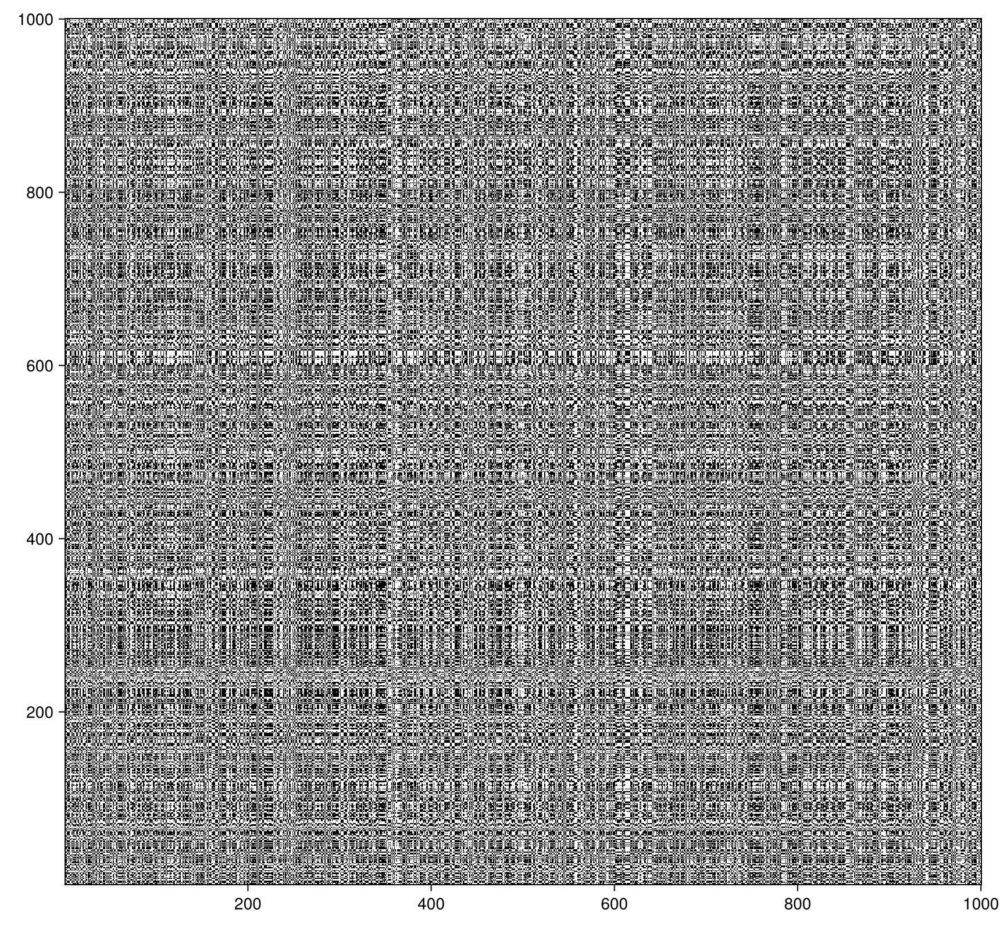

#   A Brief Theoretical Review
We do here a brief review about the recurrence field. If you are new in this area, we sincerelly expects that this review helps you 😄. If you want a more formal review, please read the publication "[Recurrence plots for the analysis of complex systems](https://www.sciencedirect.com/science/article/pii/S0370157306004066)" [Marwan2007](@cite).

##  Recurrence Plots
Recurrence Plots (RPs) were introduced by Eckmann et al. at 1987 [Eckmann1987](@cite). Given a trajectory $\mathbf{x}_i \in \mathbb{R}^m$, with $i\in\{1,2,...,K\}$ and $K$ being the length of the analyzed time series, we define the RP as a graphical representation  based on the recurrence matrix define by
$\mathbf{R}_{ij} = \Theta(\varepsilon - \|\mathbf{x}_i - \mathbf{x}_j\|),$
where $\|\cdot\|$ denotes an appropriate norm, and $\varepsilon$ is a threshold parameter that defines the maximum distance between two points for them to be considered $\varepsilon$-recurrent to each other.

In Julia, it is possible to build a RP using the library `RecurrenceAnalysis.jl` ([documentation here](https://juliadynamics.github.io/RecurrenceAnalysis.jl/stable/)). For example:

```julia recurr_analysis
using Distributions, RecurrenceAnalysis, CairoMakie

data = rand(Uniform(0, 1), 1000)
r_matrix = RecurrenceMatrix(data, 0.27)
fig, ax, rp = heatmap(r_matrix, colormap = :binary)
```



By definition, we have for a RP that $\mathbf{R}_{ii} = 1$, which the main diagonal of a recurrence matrix is filled with recurrences, being called as line of identity (LOI). The structures presented in a RP can have crucial tips about a system, in a way that some system can be caracterized by its topology and texture [Eckmann1987, Weber2014](@cite).

Talking about RQA and RMA, we just have interest about the RP texture, that is the base for these two analysis metodologies. Since we do not will really formalize this topic, it is recommended to you read the original paper, available [here](https://www.ihes.fr/~ruelle/PUBLICATIONS/%5B92%5D.pdf).

##  Recurrence Quantification Analysis
Recurrence Quantification Analysis (RQA) has become a standard tool for extracting nonlinear characteristics from time series. It relies on specific recurrence structures within Recurrence Plots (RPs), such as diagonal line lengths that are typically associated with deterministic dynamics. There are several quantification measures defined in the literature, and we strongly recommend you to read the book "[Recurrence Quantification Analysis, Theory and Best Practices](https://link.springer.com/book/10.1007/978-3-319-07155-8)" [Weber2014](@cite). In this review we just will talk about recurrence rate, determinism, laminarity and recurrence entropy, since they are the quantifiers that can be computed using RMA.

The recurrence rate (RR) is the overall density of points within a RP, and calculated as

$RR = \frac{1}{K^2-K}\sum_{i=1}^K\sum_{i\neq j = 1}^K \mathbf{R}_{ij}.$

It can be used to help calculating dynamical invariants such as correlation sum and correlation dimension. These invariants are importat dynamical properties of a system, and offer meaningful evidence in the search for chaotic behavior.

The determinism (DET) also can be seem as a density, similarly to the RR in this regard. However, it is a percentage of points that are part of diagonal lines rather than just the total density. Considering the histogram of diagonal lines length, written as

$H_D(\ell)=\sum_{i,j=1}^K(1-\mathbf{R}_{i-1,j-1})(1-\mathbf{R}_{i+l, j+l})\prod_{k=0}^{\ell - 1} \mathbf{R}_{i+k, j+k},$

DET is defined as

$DET = \frac{\sum_{\ell = d_{min}}^K \ell H_D(\ell)}{\sum_{i,j = 1}^K \mathbf{R}_{ij}},$

where the parameter $d_{min}$ sets the minimum length of the diagonal lines, being usual to use $d_{min} = 2$. DET is one of the most used in the search for deterministic behavior, since diagonal lines imply that entire sequences of states $\{\mathbf{x}_{i}, \mathbf{x}_{i+1}, ..., \mathbf{x}_{i+\ell -1}\}$ and $\{\mathbf{x}_{j}, \mathbf{x}_{j+1}, ..., \mathbf{x}_{j+\ell -1}\}$ are recurrent to each other, not only single points. This translates to the system repeating a pattern for long periods, since $\ell$ points recurring means similar system behavior for $\ell$ time steps. The nonlinear quantifier DET can also detect transitions between chaotic to regular behaviour, and vice-versa. This property can be used to search for bifurcations induced by some parameter drift in a time series, for which the DET will display an increase in value.

LAM is analogous to DET, but it is defined for vertical/horizontal lines, which completely changes its interpretation. It is defined as

$LAM = \frac{\sum_{\ell = v_{min}}^K \ell H_V(\ell)}{\sum_{i,j = 1}^K \mathbf{R}_{ij}},$

with

$H_V(\ell)=\sum_{i,j=1}^K(1-\mathbf{R}_{i,j-1})(1-\mathbf{R}_{i, j+l})\prod_{k=0}^{\ell - 1} \mathbf{R}_{i, j+k},$

and the parameter $v_{min}$ being similar to $d_{min}$. This RQA captures information about laminar behaviour. It has this interpretation because for a straight line of length $\ell$ to form in the RP, a single state $\{\mathbf{x}_i\}$ has to recur with $\ell$ other different states $\{\mathbf{x}_j, ..., \mathbf{x}_{j+\ell-1}\}$. As a consequence, the system has to stay close to a single state for $\ell$ time steps, i.e., the longer the line, the more laminar the system is. It has been shown that LAM is also able to capture dynamical transitions, much like DET, but usually even between different chaotic regimes. Henceforth, this is also a very relevant nonlinear measure extracted from RPs.

##  Recurrence Microstates Analysis
The Recurrence Microstates Analysis (RMA) has been introduced in 2018 ([read the paper here](https://repositorio.ufrn.br/server/api/core/bitstreams/259f6871-13c0-4fc8-8425-8036045f4227/content))[Corso2018](@cite), defining a new concept of microstates for a RP that is associated with features of the dynamics of the time series. This concept was used to define the quantifier of recurrence entropy (RME), written as

$RME = - \sum_{I=0}^N p_I^{(k)} \ln p_I^{(k)},$

where $I$ is the microstate index, $k$ is its size, $N$ the total amount of microstates that can be exist, being $N = 2^{k^2}$ for square motifs and $p_I^{(k)}$ the probability to found a specific microstate in a system, given by its distribution. In the following years it was shown that these structures and their distributions could be used in other applications, such as characterizationg of random dynamical systems ([Yoshito Hirata, 2021](https://www.sciencedirect.com/science/article/pii/S1007570420303828)) [Hirata2021](@cite), training neural networks ([G. S. Spezzatto et al., 2024](https://pubs.aip.org/aip/cha/article-abstract/34/7/073140/3303854/Recurrence-microstates-for-machine-learning)) [Spezzatto2024](@cite), new quantifier, such as involution simmetry ([G. Marghoti et al., 2024](https://journals.aps.org/pre/abstract/10.1103/PhysRevE.110.024203)) [Marghoti2024](@cite) or disorder (not published yet), and estimation of RQA density-based measures ([F. E. L. da Cruz et al., 2025](https://journals.aps.org/pre/abstract/10.1103/PhysRevE.111.044212)) [Felipe2025](@cite).

The goal of the `RecurrenceMicrostatesAnalysis.jl` library is to make this research field fast and easy to use, serving as a powerful tool for advancing new research and practical applications, such as in machine learning 😉.

We will explain better how compute motifs without explictly construct a RP in [motifs: shapes and sampling](motifs.md). About how estimate RQA using RMA, we use the expression proposed in [Felipe2025](@cite):

$DET \approx 1 - \frac{\mathbf{d}^{(1)}\cdot\mathcal{R}^{(3)}\cdot \mathbf{p}^{(3)}}{RR},$

$LAM \approx 1 - \frac{\mathbf{v}^{(1)}\cdot\mathcal{R}^{(3)}\cdot \mathbf{p}^{(3)}}{RR}.$

The vectors $\mathbf{d}$ and $\mathbf{v}$ are selecting the necessary terms from the resulting vector $\mathcal{R}^{(3)}\cdot \mathbf{p}^{(3)}$. In practice, for DET, the probability of all 64 motifs of the form

```math 
\begin{pmatrix} 0 & \xi & \xi \\ \xi & 1 & \xi \\ \xi & \xi & 0 \\ \end{pmatrix}
```

are summed, for all possible combinations of $\{\xi\}$. This works for the minimal length of 2, which is the implemented case. Similarly, for LAM, it uses motifs of the form

```math 
\begin{pmatrix} 0 & 1 & 0 \\ \xi & \xi & \xi \\ \xi & \xi & \xi \\ \end{pmatrix}. 
```

We optimize this process defining two new motifs shapes: diagonal and line. These shapes are derived from the matrices above, where it is possible to disregard the combination of $\{\xi\}$ without loss of generality, and use diagonal and lines structures to construct a probability distribution. With this, all motif of the forms presented above can be identified by the diagonal or line motif represented by $I = 2$.
